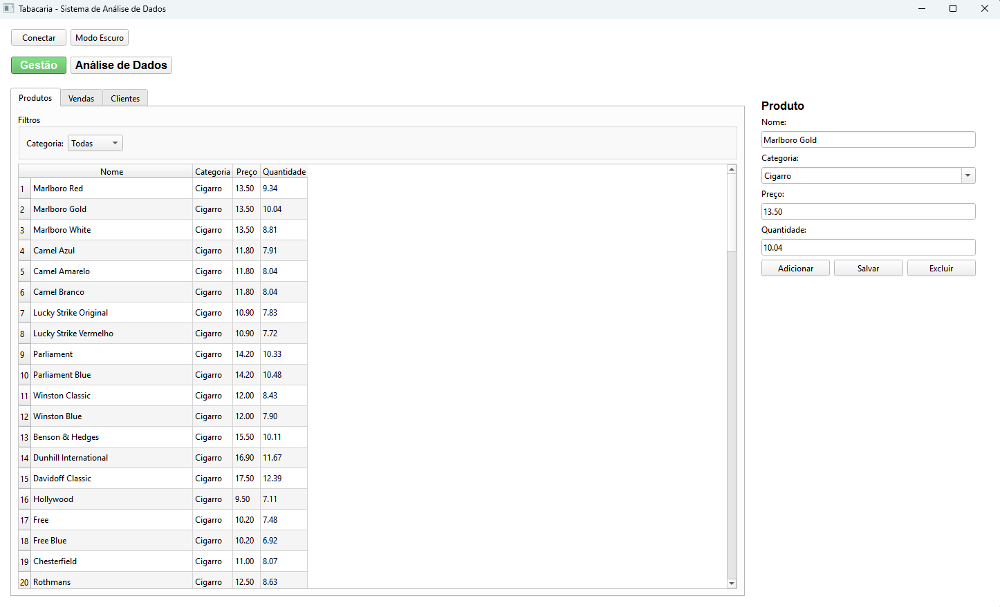
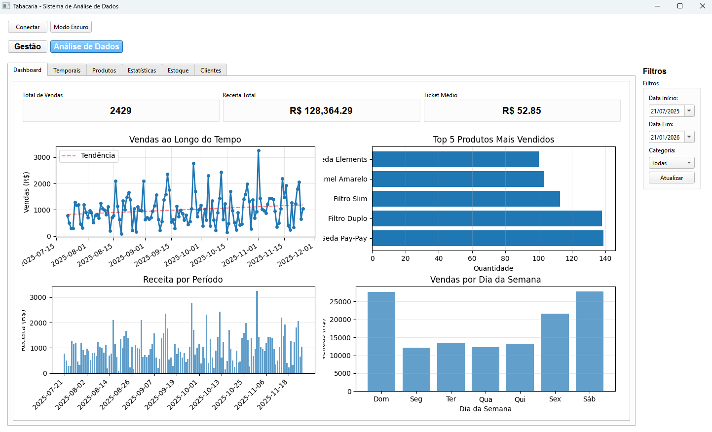

# SmokeShopERP - Sistema de Gestão e Análise de Dados para Tabacaria

Sistema desktop desenvolvido em Python para auxiliar na gestão e visualização de análises de dados relevantes para o negócio. O software oferece uma interface intuitiva para gerenciar produtos, vendas e clientes, além de fornecer análises detalhadas que auxiliam na tomada de decisões estratégicas.

## 🛠️ Stack

- **PyQt6**: Framework para interface gráfica desktop
- **PostgreSQL**: Banco de dados relacional
- **Matplotlib**: Biblioteca para criação de visualizações gráficas
- **NumPy**: Cálculos numéricos e análises estatísticas


## 🎯 Objetivos

- Desenvolver um sistema de gestão desktop usando Python para auxiliar na visualização de análises e dados relevantes para o negócio
- Disponibilizar uma visualização de fácil acesso, com visualizações relevantes para os sócios
- Integrar um sistema de gestão básico que ofereça cadastro de produtos, vendas e clientes
- Suportar conexão com banco de dados PostgreSQL


## Funcionalidades

<div align="center">
  
  
</div>

### 🎨 Interface

A interface foi desenvolvida utilizando PyQt6, organizada em uma estrutura hierárquica de abas que separa as funcionalidades principais do sistema:

- **Barra Superior**: Botões para conectar ao banco de dados e alternar tema (claro/escuro)
- **Navegação Principal**: Botões para alternar entre Gestão e Análise de Dados
- **Seção de Gestão**: Tabelas interativas com formulários laterais para CRUD
- **Seção de Análise**: Abas especializadas com gráficos e visualizações
- **Filtros Laterais**: Painel de filtros por data e categoria nas análises

### 📊 Gestão

Gerenciamento de produtos, vendas e clientes através de tabelas interativas e formulários:

- **Produtos**: Cadastro, edição, exclusão e controle de estoque. Gestão de categorias, preço e custo.
- **Vendas**: Registro de vendas com cálculo automático de total. Filtros por categoria e período. Atualização automática de estoque.
- **Clientes**: Cadastro completo (nome, email, telefone) e associação às vendas.

### 📈 Análise de Dados

Visualizações organizadas em abas especializadas:

- **Dashboard**: Métricas principais (vendas, receita, ticket médio), evolução temporal de vendas, produtos mais vendidos e sazonalidade semanal.
- **Análises Temporais**: Sazonalidade por dia da semana e tendências de crescimento/declínio por produto.
- **Análise de Produtos**: Produtos mais vendidos e análise de margem de lucro (lucro total, margem percentual, rentabilidade).
- **Estatísticas**: Estatísticas descritivas de preços, correlação preço vs quantidade e detecção de anomalias.
- **Gestão de Estoque**: Giro de estoque e dias de estoque disponível por produto.
- **Análise de Clientes**: Clientes mais frequentes, ticket médio e receita total por cliente.


## ⚙️ Setup

### 1. Instalar Dependências

```bash
pip install -r requirements.txt
```

### 2. Configurar Banco de Dados

1. Crie um banco de dados PostgreSQL chamado `TabacariaDB`:
```sql
CREATE DATABASE TabacariaDB;
```

2. Crie um arquivo `.env` na raiz do projeto com a senha do banco:
```
DB_PASSWORD=sua_senha_aqui
```

### 3. Gerar Dados de Exemplo (Opcional)

Para popular o banco com dados de exemplo:
```bash
python src/mock_data.py
```

Este script criará:
- Produtos de exemplo em várias categorias
- Clientes aleatórios
- Histórico de vendas dos últimos 12 meses

### 4. Executar a Aplicação

```bash
python src/main.py
```

## 📦 Compilação para Executável

### Usando PyInstaller

1. Instale o PyInstaller:
```bash
pip install pyinstaller
```

2. Execute o script de build:
```bash
./build_exe.sh
```

Ou manualmente:
```bash
pyinstaller --onefile --windowed --name "TabacariaDashboard" src/main.py
```

### Executando o .exe

1. Execute o arquivo executável gerado
2. Clique em "Conectar" no topo da interface
3. Configure os parâmetros de conexão:
   - Banco: `TabacariaDB` (ou o nome do seu banco)
   - Usuário: `postgres` (ou seu usuário)
   - Senha: sua senha do PostgreSQL
   - Host: `localhost` (ou endereço do servidor)
   - Porta: `5432` (porta padrão do PostgreSQL)


